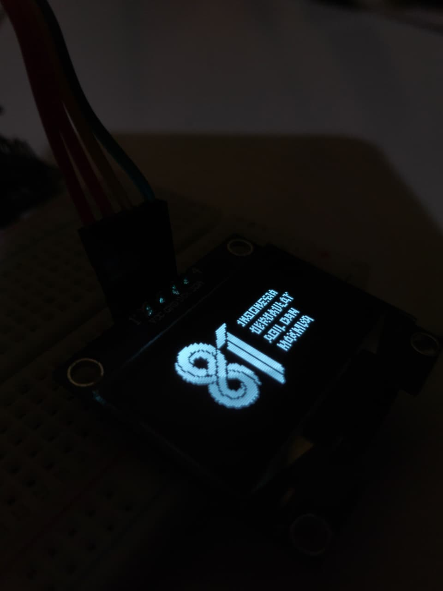
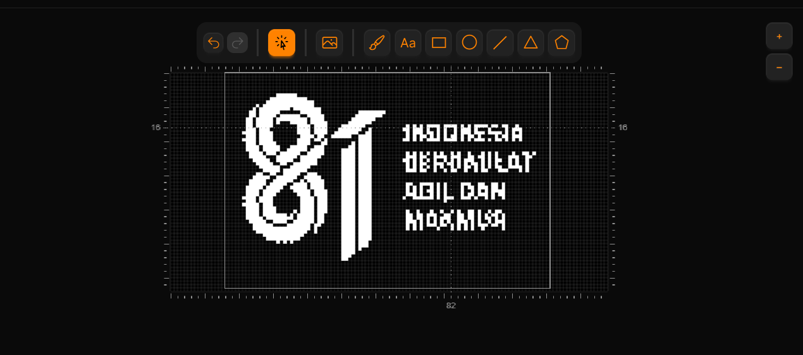

# ESP8266 OLED HUT RI 81

A simple embedded system project using an ESP8266 and a 1.3-inch OLED display to show a custom visual for the 81st Anniversary of the Independence of the Republic of Indonesia (HUT RI ke-81).

## Overview

This project uses an ESP8266 microcontroller connected to a 1.3-inch OLED display.

The display shows a custom HUT RI ke-81 graphic designed specifically for a small monochrome OLED display. The visual was designed using Lopaka and then implemented on the ESP8266.

This project was created as a small experiment in embedded systems, OLED graphics, and microcontroller-based display programming.

## Hardware

- ESP8266
- 1.3-inch OLED display
- Jumper wires
- USB cable
- Breadboard (if required)

## Software & Tools

- Arduino IDE
- Lopaka — OLED graphic design
- C/C++ — firmware development
- Git & GitHub — version control and project documentation

## Visual Design

The OLED graphic was designed using Lopaka, with consideration for the limited resolution of the display.

The design was converted into a format suitable for rendering on the OLED using the ESP8266.
## Photo Results


### Design Preview



## Project Preview


## Source Code

The ESP8266 firmware is located in:

```text
sketch_aug17a/
└── sketch_aug17a.ino
